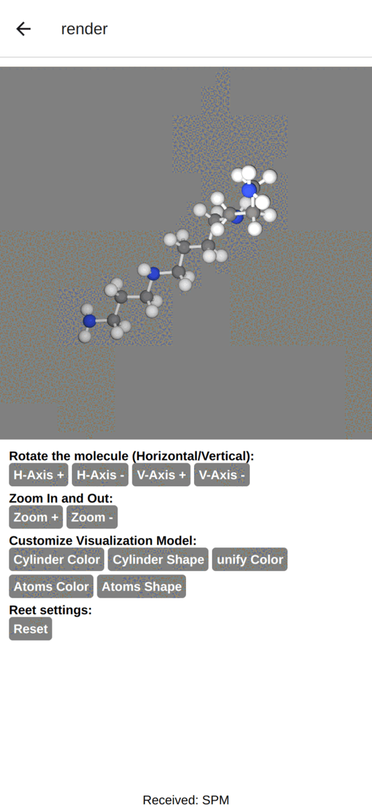

---
# 3D Protein

### Todo:
- [x] add splash screen with custom logo
- [x] add FingerPrint authentication (_if exists_).
- [x] list ligands from [./constants/ligands.json](./constants/ligands.json)
- [x] search bar to search a specific ligand from the list
- [x] if a ligand is selected (clicked) move to the render page
- [x] setup Three.js in the app
- [x] render in 3d the structure of a protein by fetching the PDB data by ligand
    - [x] fetch ligand PDB data from API
    - [x] parse it
    - [x] render
    - [ ] cache PDB data in the phone's local storage
- [ ] add utility to handle protein:
    - [x] zoom
    - [x] rotate
    - [ ] screenshot + share
    - [ ] model customization
        - [ ] update cylinder (shape + color)
        - [ ] update Atom (shape + color + 2d version)
        - [ ] unify color
    - [ ] reset settings
    - [x] Atom info (display atom's info when clicked)
- [ ] cache PDB locally
- [ ] build a `kind of` engine to render a protein from PDB.

### Conclusion:
there will be 4 screens (pages):
1. splash screen
1. home screen
2. Listing screen
3. Render screen 

    
    
    
    

