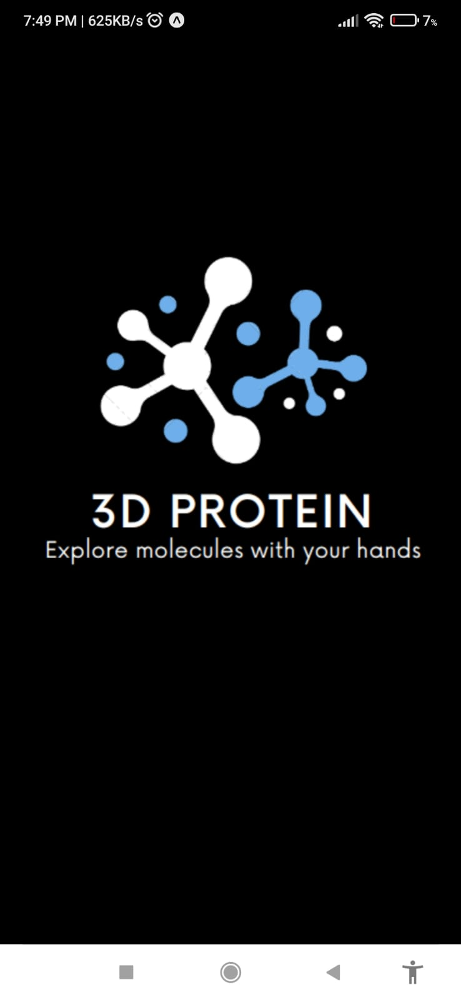
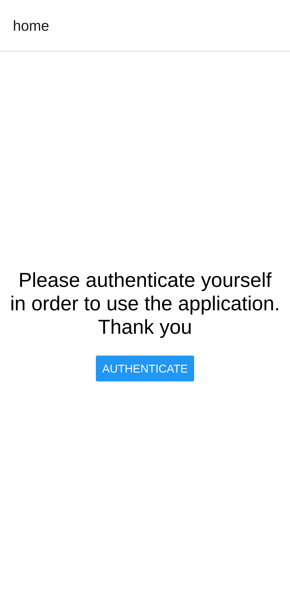
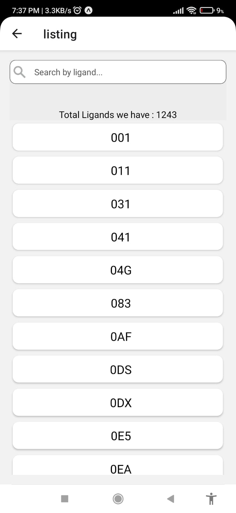
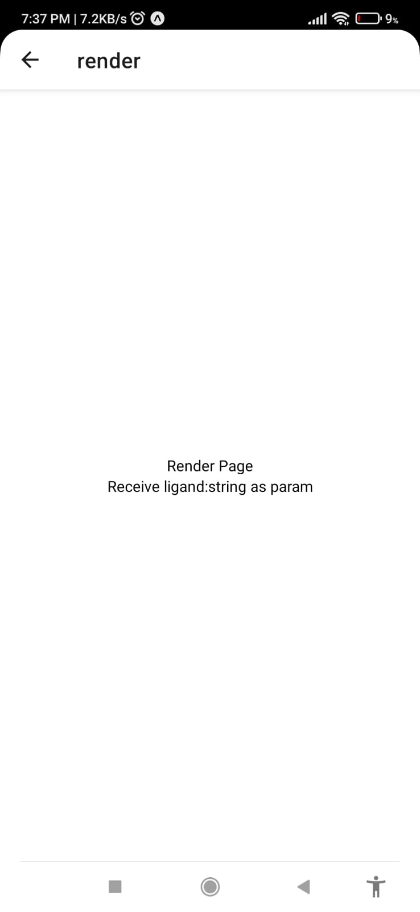

# 3D Protein
---
### Todo:
- [x] add splash screen with custom logo
- [ ] add FingerPrint authentication.
- [x] list ligands from [./const/ligands.json](./const/ligands.json)
- [x] search bar to search a specefic ligand from list
- [x] if a ligand is selected (clicked) move to render page
- [ ] render in 3d the structure of protein by fetching the PDB data by ligand

### Conclusion:
there will be 4 screens (pages):
1. splash screen
1. home screen
2. Listing screen
3. Render screen 

    
    
    
    

